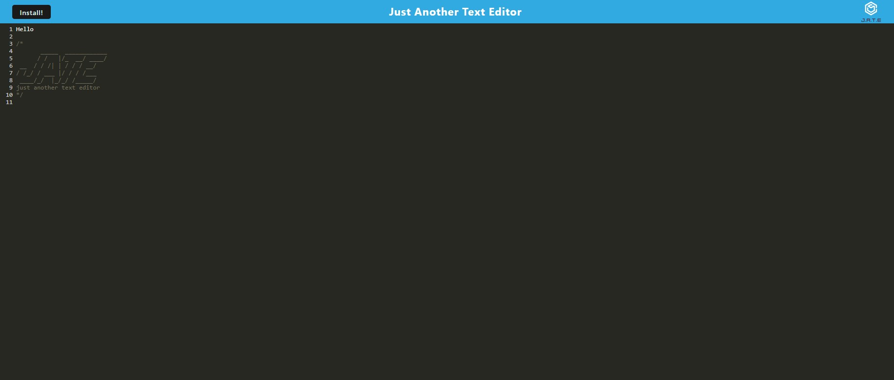

# Text-Editor

 

This is a text editor that is a progressive web application. It utilizes indexedDb to store the content of the text editor, webpack to bundle assets, and a service worker to cache the assets.

## Getting Started

There are no prerequisites pertaining to this application. Simply head to the deployed link shown below and start typing.

### Screenshot

Shown below is the deployed page.

## Built With

* [HTML](https://developer.mozilla.org/en-US/docs/Web/HTML)
* [CSS](https://developer.mozilla.org/en-US/docs/Web/CSS)
* [Javascript](https://developer.mozilla.org/en-US/docs/Web/JavaScript)
* [NodeJS] (https://nodejs.org/en/docs/)
* [WebPack] (https://webpack.js.org/)

## Deployed Link

* [See Live Site](https://boiling-inlet-17978.herokuapp.com/)

## Authors

* **David Chou** 

- [Link to Portfolio Site](https://dazedchou.github.io/Portfolio/)
- [Link to Github](https://github.com/dazedchou)
- [Link to LinkedIn](https://www.linkedin.com/in/davidchou99)

## License

This project is licensed under the MIT License 

